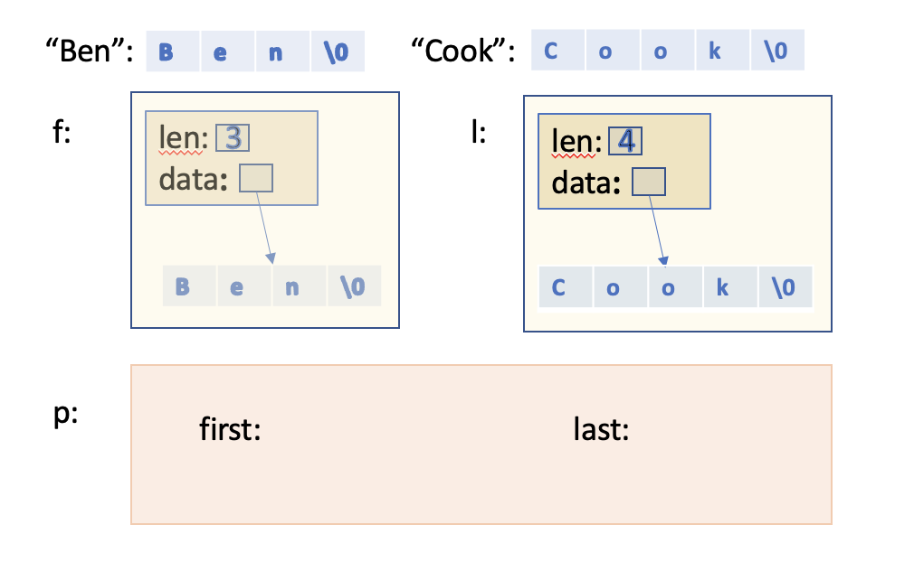
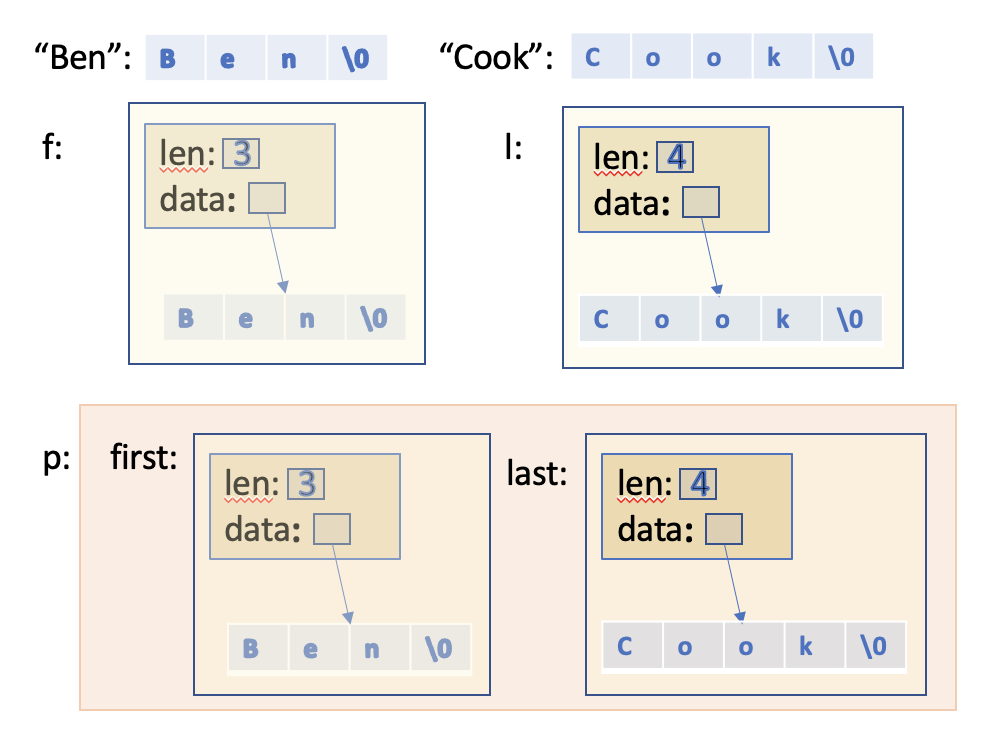

## How To Benefit From Move Semantics

### Avoid Objects with Names

Move semantics allows us to optimize using a value from a source that no longer needs that value. If compilers automatically detect that a value is used from an object that is at the end of its lifetime, they will automatically switch to move semantics. This is the case when:
* we pass a temporary object that will automatically be destroyed after the statement
* we return a local object by value
In addition, we can force move semantics by marking an object with `std::move()`.
A first consequence of move semantics is the following: **avoid objects with names**.
Instead of
```cpp
MyType x{42, "hello"};
foo(x); // x not used afterwards
```
it would be better to write:
```cpp
foo(MyType{42, "hello"});
```
to automatically enable move semantics.
Of course, the advice to avoid objects with names might conflict with other important style guidelines such as readability and maintainability of source code. Instead of having a complex statement, it might be better to use multiple statements. In that case, you should use `std::move()` if you no longer need an object (and know that copying the object might take significant time):
```cpp
foo(std::move(x));
```

### When You Cannot Avoid Using Names

Thee are cases where you cannot avoid using `std::move()` because you have to give objects names. The most obvious typical examples are:
* You have to use an object multiple times. For example, you might get a value to process it twice in a function or a loop:
```cpp
std::string str{getData()};
...
coll1.push_back(str);   // copy (still need the value of str)
coll2.push_back(std::move(str)); // move (no longer need the value of str)
``` 
The same applies when inserting the value in the same collection twice or calling two different functions storing the value somewhere.
* You have to deal with a parameter. The most common example of this is the following loop:
```cpp
// read and store line by line from myStream in coll
std::string line;
while (std::getline(myStream, line)) {
  coll.push_back(std::move(line));  // move (no longer need the value of line)
}
```

#### Avoid Unnecessary `std::move()`

Returning a local object by value automatically uses move semantics if supported. However, just to be safe, programmers might try to force this with an explicit `std::move()`:

```cpp
std::string foo()
{
  std::string s;
  ...
  return std::move(s); // BAD: do not do this
}
```
Remember that `std::move() is just a static_cast` to an rvalue reference. Therefore, `std::move(s)` is an expression that yields the type `std::string&&`. However, this no longer matches the return type and therefore disables the `return value optimization`, which usually allows the returned object to be used as a return value. For types where move semantics is not implemented, this might even force the copying of the return value instead of just using the returned object as the return value.
Therefore, if you return local objects by value, do not use `std::move()`:

```cpp
 std::string foo()
 {
   std::string s;
   ...
   return s;  // best performance (return value optimization or move)
 }
```

Using ```std::move()``` when you already have a temporary object is at least redundant. For a function `createString()` that returns an object by value, you should just use the return value:

```cpp
 std::string s{createString()};  // OK
```

instead of marking it with `std::move()` again:

```cpp
 std::string s{std::move(createString())};  // BAD: do not do this
```  

Compilers might (have options to) warning about any counterproductive or unnecessary use of `std::move()`. For example, *gcc* has the options `-Wpessimizing-move` (enabled with `-Wall`) and `-Wredundant-move` (enabled with `-Wextra`). 
  There are applications, though, where a `std::move()` in a return statement might be appropriate. One example is moving out the value of a member. Another example is returning a parameter with move semantics. 


### Initialize Members with Move Semantics

A surprising consequence of the way the move semantics is defined is that you can benefit from it even in trivial classes with members of types that benefit from move semantics (such as string members or containers).
 Let us look at this with a simple example.

#### Initialize Members the Classical Way

Consider a class with two string members, which we can initialize in the constructor. Such a class will typically be implemented like this:

`basics/initclassic.hpp`
```cpp
#include <string>

class Person {
private:
 std::string first; // first name
 std::string last;  // last name
public:
 Person(const std::string& f, const std::string& l)
  : first{f}, last{l} {
 }
 ...
};
```

Now let us look what happens when we initialize an object of this class with two string literals:

```cpp
 Person p{"Ben", "Cook"};
```
The compiler finds that the provided constructor can perform the initialization. However, the types of the parameters do not fit. Therefore the compiler generates code to first create two temporary `std::string`s, which are initialized by the values of the two string literals, and binds the parameters `f` and `l` to them: 



In general (if the small string optimization (SSO) is not available or the string is too long), this means that code is generated that allocates memory for the value of each `std::string`. 
 However, the temporary strings created are not used directly as members `first` or `last`. Instead, they are used to initialize these members. Unfortunately, the move semantics is not used here for two reasons:
* The parameters `f` and `l` are objects with names that exist for a longer period than the initialization of the members (you can still use them in the body of the constructor).
* The parameters are declared to be `const`, which disables the move semantics even if we use `std::move`. 

As a consequence, the copy constructor for strings is called on each member initialization, again allocating memory for the values:



